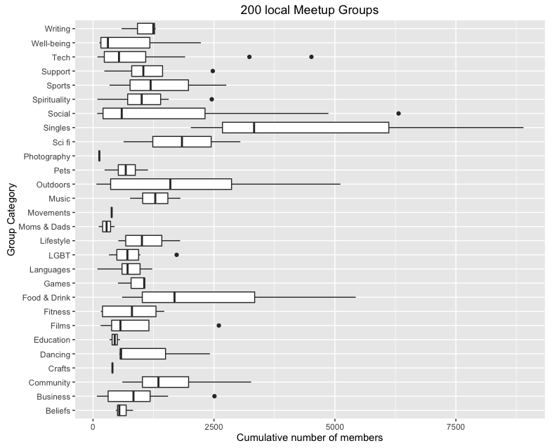

# tidymeetups
Extracting and analyzing data from Portland meetups using the [tidyjson package](https://cran.r-project.org/web/packages/tidyjson/README.html).  

[meetup_with_tidyjson .Rmd](./meetup_with_tidyjson_.Rmd) has a vignette that walks through some of the the necessary steps for extraacting data from the http://meetup.com API.

Here is a little sample of the output that combines data from different levels in the json in a tidy format:
